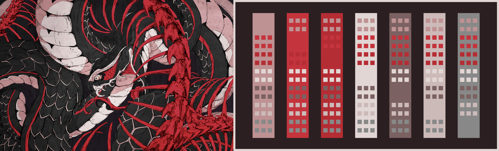

# Paletter

Generates images with color palette from provided picture

## Examples





## Dependencies

-   Python 3.9+
-   Poetry

## Install

Clone this repo and install dependencies

```bash
git clone https://github.com/metafates/Paletter.git
cd Paletter
poetry install
```

Then you can run the script by running

```bash
poetry run python paletter/paletter.py
```

Or you can build an executable with

```bash
poetry run pyinstaller --onefile --paths paletter paletter/paletter.py
```

This will create an executable at `dist/paletter`

## Usage

```
usage: main.py [-h] [--out OUT] [--colors COLORS] [--contrast CONTRAST] [--no-squares] [--no-border] image

Generates color palette from image

positional arguments:
  image                Image to work with

options:
  -h, --help           show this help message and exit
  --out OUT            Generated image path (without extension)
  --colors COLORS      Number of colors in the palette
  --contrast CONTRAST  Minimum contrast ratio between primary color and colors in palette
  --no-squares         Do not draw squares on the color blocks
  --no-border          Do not add border to the image
```
